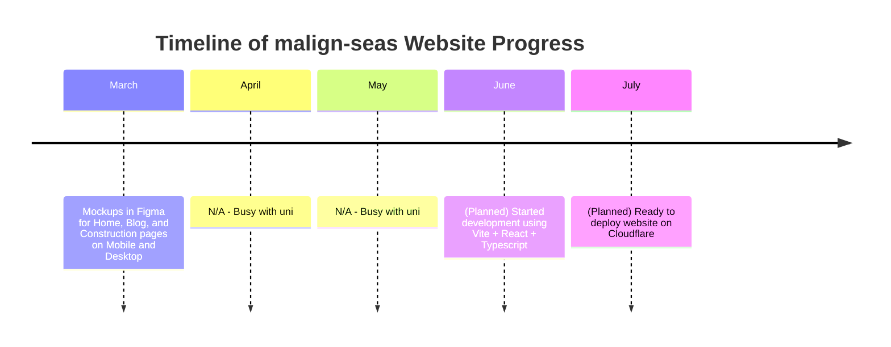

## malign-seas

### Current Work-In-Progress Personal Projects
- **malign-seas website**: A personal hobby JAMStack site to be hosted on CloudFlare. 
- **Echo-Exodus**: A React app that uses [yt-dlp](https://github.com/yt-dlp/yt-dlp) and the [Youtube Data API](https://developers.google.com/youtube/v3) to mass-download songs from exported Spotify library json files.

